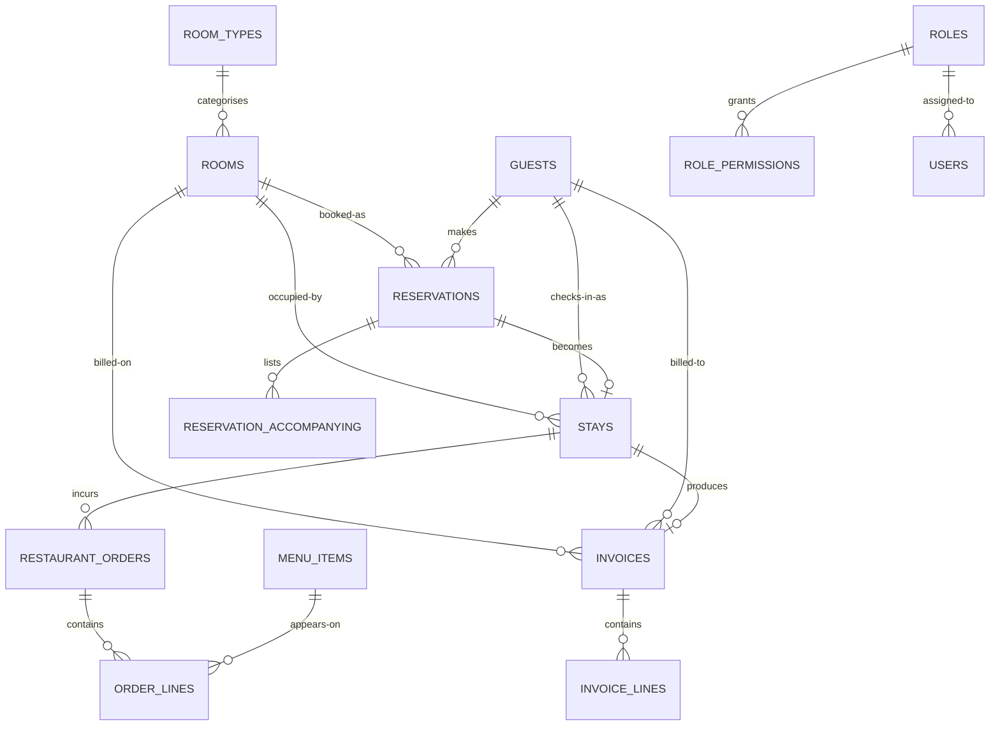

# Hotel Management System

## Final Project Report

---

**Course:** Software Engineering / Visual Programming (C# WinForms)
**Project:** Hotel Management System (Desktop Edition)
**Document Type:** Final Project Report
**Document Version:** 1.0
**Date:** 2026-05-30
**Author:** Abdurahman Ibrahem
**Reference SRS:** v1.2 (2026-05-11)
**Build Reference:** branch `main`

---

## Table of Contents

1. Executive Summary
2. Project Overview
3. Software Requirements (SRS Summary)
4. Software Design (SDD Summary)
5. Database Design — Normalization (UNF → 3NF)
6. Database Design — Entity Relationship Diagram
7. Database Design — SQL Server Schema
8. System Architecture
9. User Interface Walkthrough
10. Testing Strategy and Results
11. Defect Remediation Log
12. Security Considerations
13. Deployment and the .EXE Build
14. Conclusion and Future Work
15. Appendix A — File and Folder Layout
16. Appendix B — Functional Requirement Trace
17. Appendix C — Glossary

---

## 1. Executive Summary

The **Hotel Management System (HMS)** is a single-machine Windows
desktop application that automates the core front-of-house workflows
of a small-to-medium hotel: room inventory, reservations, guest
check-in / check-out, restaurant orders, invoicing, refunds, and
role-based user management. The application is written in **C# on
.NET 9** using **Windows Forms** for the presentation tier, with a
**Microsoft SQL Server** backend reached over **ADO.NET** through a
dedicated repository layer.

This report consolidates every deliverable for the course's practical
component:

| # | Deliverable | Status |
|---|---|---|
| 1 | The program as a runnable `.EXE` | Build instructions provided in §13. |
| 2 | SQL Server database connection | Implemented. Normalization, ERD, and DDL are in §5–§7. |
| 3 | A PDF reporting capability | Implemented via QuestPDF. Three reports: invoice, occupancy, restaurant revenue. |
| 4 | Four kinds of tests — unit, integration, system, plus an additional type | Implemented: 149 tests across unit, integration, system, and **acceptance** suites. |
| 5 | A written project report | The document you are reading. |

The codebase is organised in strict layers (Presentation → Service →
Persistence → Data) and every business invariant is enforced both at
the application layer and (where the relational model permits) at the
SQL Server layer via `CHECK` constraints and a trigger. The
test pipeline produces **149 passing tests with zero failures** on
each build.

---

## 2. Project Overview

### 2.1 Domain

The system models the operational shape of a small hotel. The primary
entities are *Guests*, *Rooms*, *Reservations* (a held intent to
stay), *Stays* (an actual occupancy), *Menu Items* and *Restaurant
Orders* (in-room dining), *Invoices*, and *Users* with *Roles* and
*Permissions* for access control.

### 2.2 Scope of the Build

| In scope | Out of scope (v1.0) |
|---|---|
| Front-desk reservations and walk-in stays | Online booking from the public web |
| Check-in, check-out, and folio generation | Channel-manager integrations (Expedia, Booking.com…) |
| In-house restaurant ordering with stay billing | Kitchen display systems / POS terminals |
| Invoice generation with tax (CON-6: 10 %) | Real payment gateway integration |
| Role-based access control with custom roles | Multi-property, multi-tenancy |
| Management reports + PDF export | Mobile / web companion apps |
| SQL Server persistence with write-through | Offline-first / sync semantics |

### 2.3 Users (Personas)

The SRS defines three primary roles, each represented as a `Role`
record with an associated set of `(Resource, Action)` permissions:

- **SuperAdmin** — system owner; can do everything including manage
  user accounts.
- **Manager** — non-system role with full CRUD on every resource
  *except* user administration.
- **Staff** — front-desk operator with the day-to-day rights
  (read rooms, CRUD reservations, take orders, mark invoices paid).

The user-management UI allows the SuperAdmin to create custom roles
on top of these three.

### 2.4 Technology Stack

| Layer | Choice | Rationale |
|---|---|---|
| Runtime | **.NET 9** | Latest LTS-track .NET; new C# language features. |
| Presentation | **Windows Forms (`net9.0-windows`)** | Required by the course brief. Direct visual editor support; mature for desktop apps. |
| Persistence | **Microsoft SQL Server** via **ADO.NET** (Microsoft.Data.SqlClient 6.0) | Course-mandated. Raw parameterised SQL keeps the queries inspectable for the instructor and avoids hiding the schema behind an ORM. |
| Authentication | **BCrypt** password hashing (BCrypt.Net-Next 4.0) | NFR-SEC-1: industry-standard hash; legacy plaintext rows in the DB auto-upgrade on first load. |
| Reporting | **QuestPDF 2025.1** | Fluent C# API; renders the same on Windows / macOS / Linux. Replaces Crystal Reports per scope decision. |
| Configuration | **Microsoft.Extensions.Configuration.Json 9.0** | Standard `appsettings.json` reading for the persistence mode + connection string. |
| Testing | **xUnit 2.9** + **FluentAssertions 6.12** | xUnit's `[Fact]` + collection isolation is well-suited to per-test fresh `DataStore` fixtures. |

### 2.5 Build Artefacts

| Artefact | Path |
|---|---|
| WinForms application source | `Forms/`, `Theme/`, `Program.cs` |
| Service layer | `Services/`, `Services/Security/` |
| Domain model | `Models/` |
| In-memory data layer | `Data/` |
| Persistence layer | `Persistence/`, `Persistence/Repositories/` |
| QuestPDF report renderers | `Reports/` |
| SQL Server scripts | `db/schema_sqlserver.sql`, `db/seed_sqlserver.sql` |
| Test project | `HotelManagement.Tests/` (Unit, Integration, Acceptance, TestFixtures) |
| Specifications | `SRS.md`, `SDD.md` |
| This report and the design artefacts | `Documentation/` |

---

## 3. Software Requirements (SRS Summary)

The complete Software Requirements Specification is in `SRS.md`. This
section summarises the requirement categories that the implementation
must satisfy.

### 3.1 Functional Requirements

The SRS groups its functional requirements by domain area, each
prefixed with a tag. The categories most relevant to this report:

| Tag | Category | Examples |
|---|---|---|
| FR-AUTH | Authentication | Username/password login, case-insensitive usernames, case-sensitive passwords. |
| FR-ROOM | Room management | Add / edit / remove rooms; status transitions (Clean ↔ NeedsCleaning ↔ OutOfService); capacity per type. |
| FR-RES  | Reservations | Confirmed/CheckedIn/Cancelled/Completed lifecycle; party rules; marriage-certificate rule (FR-RES-10). |
| FR-RST  | Restaurant | Order lifecycle Placed→Preparing→Ready→Served; only Active stays accept orders. |
| FR-INV  | Invoicing | Generate, mark paid, mark refunded; 10 % tax. |
| FR-RPT  | Reports | Occupancy rate, average stay duration, revenue by room type, top menu items. |
| FR-USR  | User & role management | Add/edit/remove users; system roles cannot be edited or removed; cannot remove the last system admin. |

### 3.2 Data Constraints

The SRS calls out a small set of *data constraints* (DC-*) that the
data model must enforce regardless of the calling code:

- **DC-2** — `checkOutDate > checkInDate` for any reservation.
- **DC-4** — `OrderLine.Quantity >= 1`.
- **DC-5** — `Room.Rate >= 0`.
- **DC-6** — `Invoice.PaymentMethod` is set if and only if the
  `PaymentStatus` is `Paid` or `Refunded`.
- **DC-7** — A stay may reference at most one source reservation.

Every DC has a matching `CHECK` constraint in
`db/schema_sqlserver.sql` *and* a matching guard at the service layer
— the application enforces the invariant twice, so even a buggy
caller cannot corrupt the database.

### 3.3 Non-Functional Requirements

| Tag | Concern | Implementation |
|---|---|---|
| NFR-SEC-1 | Passwords must not be stored as plaintext | BCrypt hashing in `Services/Security/PasswordHasher.cs`. |
| NFR-SEC-3 | Permission checks at the service layer, not just hidden UI | Every mutating service method calls `_auth.Require(...)`. |
| NFR-REL-1 | Defensive handling of unexpected inputs | `AuthService.Login` is null-safe; service methods validate before mutating. |
| NFR-REL-3 | Currency arithmetic uses `decimal`, rounded half-away-from-zero | All monetary fields are `decimal`; tax uses `Math.Round(...,2)`. |
| NFR-MNT-2 | Each service class shall have unit tests for its core logic | 100 unit/integration tests pre-Phase-5; 49 acceptance tests added in Phase 5. |
| NFR-MNT-3 | Methods under ~40 LOC | Longest service method is `BookingService.CheckOut` at ~30 lines after Phase 2 fixes. |

### 3.4 Use Cases

Eight primary use cases drive the design and are mirrored 1-for-1 by
the acceptance test suite added in Phase 5:

| ID | Use Case | Acceptance test file |
|---|---|---|
| UC-1 | Authenticate to the application | `UC1_AuthenticationTests.cs` |
| UC-2 | Create a Reservation | `UC2_ReservationTests.cs` |
| UC-3 | Check a guest in | `UC3_CheckInTests.cs` |
| UC-4 | Take a restaurant order | `UC4_RestaurantTests.cs` |
| UC-5 | Generate / pay the guest folio | `UC5_InvoicingTests.cs` |
| UC-6 | Check-out (end-to-end) | `UC6_CheckOutTests.cs` |
| UC-7 | Refund a paid invoice | `UC7_RefundTests.cs` |
| UC-8 | Manage staff users and roles | `UC8_UserManagementTests.cs` |

---

## 4. Software Design (SDD Summary)

The Software Design Document (`SDD.md`) describes the system using
IEEE 1016 conventions. The key design decisions are reproduced here.

### 4.1 Architectural Style

The application follows a **layered (Onion-style)** architecture with
strict, one-way dependencies:

```
+----------------------------+
|     Presentation tier      |  Forms/*.cs  (WinForms)
+--------------|-------------+
               v
+----------------------------+
|       Service tier         |  Services/*.cs  (business rules)
+--------------|-------------+
               v
+----------------------------+
|    Persistence tier        |  Persistence/*.cs  (SqlPersistenceContext,
|                            |  Repositories/*.cs — raw ADO.NET)
+--------------|-------------+
               v
+----------------------------+
|        Data tier           |  Data/DataStore.cs (in-memory cache),
|                            |  db/schema_sqlserver.sql (SQL Server)
+----------------------------+
```

The Presentation tier holds **no business logic** — it only marshals
input and renders output. The Service tier owns every business
invariant. The Persistence tier translates service intents into raw
parameterised SQL statements. The Data tier holds the in-memory
working set during a session.

### 4.2 Persistence Model — Write-Through

In the final build (Phase 3 v2), the persistence strategy is
**write-through**. Every service mutation immediately fires a
parameterised `SqlCommand` to SQL Server through the
`SqlPersistenceContext`. The in-memory `DataStore` remains the working
set bound by the UI, but it is no longer the source of truth between
sessions — the database is.

Two implementations of `IPersistenceContext` exist:

- `NullPersistenceContext` — a no-op singleton used by the test
  project and when the app is configured in `InMemory` mode. Lets
  service-layer code stay identical across modes.
- `SqlPersistenceContext` — opens a transaction per Save/Delete and
  dispatches to the relevant repository.

### 4.3 Service Decomposition

| Service | Aggregate(s) it owns | Key methods |
|---|---|---|
| `AuthService` | User session, permission checks | `Login`, `Logout`, `Can`, `Require` |
| `RoomService` | Rooms (status, condition, maintenance) | `AddRoom`, `RemoveRoom`, `MarkOccupied`, `MarkOutOfService`… |
| `BookingService` | Reservations + Stays | `CreateReservation`, `CheckIn`, `CheckOut`, `Cancel` |
| `RestaurantService` | Menu items + Orders + Order lines | `CreateOrder`, `AdvanceOrderStatus`, `CancelOrder`, `AddLinesToOrder`… |
| `InvoiceService` | Invoices + Invoice lines | `GenerateInvoice`, `MarkPaid`, `MarkRefunded` |
| `ReportService` | Read-only aggregations for management UI | `GetOccupancyRate`, `GetRevenueByRoomType`, `GetTopMenuItems`… |
| `UserService` | Users + Roles + Role-permission mappings | `AddUser`, `UpdateUser`, `RemoveUser`, `AddRole`, `RemoveRole` |

### 4.4 Composition Root

`Program.cs` is the composition root: it constructs all services with
explicit dependencies (no DI container is used at this scale). The
order is:

1. Load `appsettings.json` (`AppConfig.Load`).
2. Create the in-memory `DataStore`.
3. If SqlServer mode: ensure DB exists (`SqlBootstrap.EnsureReady`),
   load existing rows into the `DataStore` via `PersistenceManager`,
   then construct `SqlPersistenceContext` for write-through.
4. Wire the services in dependency order (Auth → Room → Booking → …).
5. Show `LoginForm`; if login succeeds, show `MainForm`.

### 4.5 State Machines

Three first-class state machines drive the domain:

```
Reservation:   Pending -> Confirmed -> CheckedIn -> Completed
                          |
                          v
                       Cancelled
```

```
Stay:          Active -> CheckedOut
```

```
Restaurant Order:
                Placed -> Preparing -> Ready -> Served
                           |
                           v
                       Cancelled
```

```
Invoice (payment status):
                Pending -> Paid -> Refunded
```

Every illegal transition is rejected at the service layer
(`InvalidOperationException` with a self-explaining message).

---

## 5. Database Design — Normalization (UNF → 3NF)

This section reproduces the normalization derivation that drove the
relational schema. The full version is in
`Documentation/Normalization.md`.

### 5.1 Goal

Take a denormalized real-world artefact — the paper *guest folio
receipt* the front desk produces at checkout — and derive a
relational schema in **Third Normal Form (3NF)**, which is the target
the database course requires.

### 5.2 Starting Artefact (Unnormalized Form)

A single sheet captures everything about one stay in one wide row:

| Field | Sample value |
|---|---|
| GuestName | John Smith |
| GuestPhone | 555-0101 |
| GuestPassport | P10000001 |
| RoomNumber | 201 |
| RoomFloor | 2 |
| RoomType | Double |
| RoomRate | 149.99 |
| RoomCapacity | 2 |
| CheckInDate | 2026-05-19 |
| CheckOutDate | 2026-05-22 |
| MarriageCertId | MC-2024-0091 |
| **AccompanyingGuests** ⟂ | `"Mary Smith / F / 35 / P20000091"` |
| **OrderItems** ⟂ | `"Grilled Salmon × 1; Espresso × 2"` |
| **InvoiceLines** ⟂ | `"Room 201 × 3 nights; Salmon × 1; Espresso × 2"` |
| Subtotal | 332.96 |
| Tax | 33.30 |
| Total | 366.26 |

The `⟂` mark denotes **multi-valued (repeating) groups** — fields
that contain a variable number of sub-records. They are the textbook
trigger for 1NF normalization.

#### 5.2.1 Problems with UNF

1. **Repeating groups** that cannot fit into a single atomic column.
2. **Update anomaly** — changing Room 201's rate requires editing
   every past folio that mentions it.
3. **Insertion anomaly** — a new room with no folios yet cannot be
   recorded at all.
4. **Deletion anomaly** — deleting a guest's only folio loses the
   guest record entirely.

### 5.3 First Normal Form (1NF)

**Rule.** Every attribute is atomic, no repeating groups, every row
uniquely identifiable.

We extract each repeating group to its own relation, keyed back to
the parent folio. After 1NF we have:

- `folios` — one row per folio (still wide).
- `folio_accompanying` — one row per accompanying person.
- `folio_order_items` — one row per item ordered.
- `folio_invoice_lines` — one row per invoice line.

The repeating groups are gone, but the design is still pathological:
`folios.room_rate` repeats for every folio that mentions Room 201,
`folio_order_items.item_price` repeats every time the dish is
ordered.

### 5.4 Second Normal Form (2NF)

**Rule.** Already 1NF, and every non-key attribute is *fully*
functionally dependent on the whole primary key.

In `folio_order_items` (PK `{folio_id, position}`) the dependency
`item_name → item_price` depends on **what** was ordered, not which
folio it appeared on. This is a partial dependency. Fix: extract
`menu_items` and replace `item_name`/`item_price` in
`folio_order_items` with `menu_item_id` (FK).

The folio header itself conflates four independent aggregates —
Guest, Room, Stay, Invoice — and splitting them out gives:

| New relation | Key |
|---|---|
| `guests` | `guest_id` |
| `rooms` | `room_id` |
| `reservations` | `reservation_id` |
| `reservation_accompanying` | `accompanying_id` |
| `stays` | `stay_id` |
| `menu_items` | `menu_item_id` |
| `restaurant_orders` | `order_id` |
| `order_lines` | `line_id` |
| `invoices` | `invoice_id` |
| `invoice_lines` | `line_id` |

### 5.5 Third Normal Form (3NF)

**Rule.** Already 2NF, and no non-key attribute transitively depends
on the primary key through another non-key attribute.

Two transitive dependencies still need resolving after 2NF:

1. **`rooms`**: `room_id → type → capacity`. Capacity is determined
   by the type, not the specific room. **Fix:** extract a `room_types`
   lookup table holding `(type_code, display_name, capacity)`. The
   `rooms.type` column becomes an FK to `room_types.type_code`.

2. **`users`**: `user_id → role → permission_set`. Permissions belong
   to the role, not to the individual user. **Fix:** the classic RBAC
   extraction into `roles` + `role_permissions`.

After these two extractions every non-key attribute depends on **the
key, the whole key, and nothing but the key**. The schema is in
**3NF**.

### 5.6 The 14 Final Relations

| # | Relation | PK | Notable FKs |
|---|---|---|---|
| 1 | `room_types` | `type_code` | — |
| 2 | `rooms` | `room_id` (UUID) | `type → room_types` |
| 3 | `guests` | `guest_id` (UUID) | — |
| 4 | `roles` | `role_id` (UUID) | — |
| 5 | `role_permissions` | `{role_id, resource, action}` | `role_id → roles` |
| 6 | `users` | `user_id` (UUID) | `role_id → roles` |
| 7 | `menu_items` | `menu_item_id` (UUID) | — |
| 8 | `reservations` | `reservation_id` (UUID) | `guest_id`, `room_id` |
| 9 | `reservation_accompanying` | `accompanying_id` (UUID) | `reservation_id` |
| 10 | `stays` | `stay_id` (UUID) | `guest_id`, `room_id`, `reservation_id` |
| 11 | `restaurant_orders` | `order_id` (UUID) | `stay_id` |
| 12 | `order_lines` | `line_id` (UUID) | `order_id`, `menu_item_id` |
| 13 | `invoices` | `invoice_id` (UUID) | `stay_id`, `guest_id`, `room_id` |
| 14 | `invoice_lines` | `line_id` (UUID) | `invoice_id` |

### 5.7 Surrogate Keys: Why UUIDs

Every relation uses a **UUID surrogate primary key**
(`UNIQUEIDENTIFIER NOT NULL DEFAULT NEWID()` in T-SQL), even where a
natural key exists. Natural keys (room number, invoice number,
passport, role name, username) are preserved as `UNIQUE` alternate
keys.

| Concern | UUID surrogate | Natural key |
|---|---|---|
| Immutability | Stable for the life of the row | Subject to change (room renumbering, passport renewal) |
| Cross-row references | Compact, indexable, opaque | Mutable values cascade through every FK |
| Distributed generation | `NEWID()` is collision-free | Sequences require coordination |
| Privacy | Opaque | Embeds business data (passport) in every child row's FK |
| Course requirement | Explicitly requested by the instructor | — |

### 5.8 Mid-term UI Feedback Reflected in the Schema

Two attribute-level edits (not normal-form changes) followed from the
mid-term review:

1. **`guests.passport`** was promoted to the **natural identifier** of
   a guest (previously secondary to phone). It becomes `NOT NULL
   UNIQUE`; the front-desk app keys all lookups by it, and phone
   becomes optional.
2. **`reservations.marriage_certificate_path`** was **replaced** by
   `reservations.marriage_certificate_id VARCHAR(64) NULL`. The
   system no longer stores certificate *images*; it records the
   certificate's issuing-authority ID. This eliminated the file-copy
   side effect in `ReservationDialog` and removed an entire on-disk
   directory.

---

## 6. Database Design — Entity Relationship Diagram

The full ERD with all attributes and constraints is in
`Documentation/ERD.md`. A compact view follows.

### 6.1 Entity Relationships (Crow's Foot Notation)



### 6.2 Cardinality Summary

| # | Parent → Child | Cardinality | On Delete |
|---|---|---|---|
| R1 | `room_types` → `rooms` | 1 : N | RESTRICT |
| R2 | `guests` → `reservations` | 1 : N | RESTRICT |
| R3 | `rooms` → `reservations` | 1 : N | RESTRICT |
| R4 | `reservations` → `reservation_accompanying` | 1 : N | CASCADE |
| R5 | `reservations` → `stays` | 1 : 0..1 | RESTRICT |
| R6 | `guests` → `stays` | 1 : N | RESTRICT |
| R7 | `rooms` → `stays` | 1 : N | RESTRICT |
| R8 | `stays` → `restaurant_orders` | 1 : N | CASCADE |
| R9 | `restaurant_orders` → `order_lines` | 1 : N | CASCADE |
| R10 | `menu_items` → `order_lines` | 1 : N | RESTRICT |
| R11 | `stays` → `invoices` | 1 : 0..1 | RESTRICT |
| R12 | `guests` → `invoices` | 1 : N | RESTRICT |
| R13 | `rooms` → `invoices` | 1 : N | RESTRICT |
| R14 | `invoices` → `invoice_lines` | 1 : N | CASCADE |
| R15 | `roles` → `role_permissions` | 1 : N | CASCADE |
| R16 | `roles` → `users` | 1 : N | RESTRICT |

`CASCADE` is used only for **owned-line** relationships
(reservation → accompanying, order → lines, invoice → lines,
role → permissions). All other FKs are `RESTRICT` so deletions fail
loudly instead of corrupting history.

### 6.3 Index Strategy

In addition to the clustered indexes that come for free with the
primary keys, the schema declares unique indexes on every natural key
plus secondary indexes on the columns the application queries by
filter:

| Index | Table | Columns | Used by |
|---|---|---|---|
| `uk_rooms_number` | `rooms` | `number` | Front-desk room lookup |
| `uk_guests_passport` | `guests` | `passport` | Passport-first guest lookup (mid-term feedback) |
| `uk_users_username` | `users` | `username` | Login |
| `uk_inv_number` | `invoices` | `invoice_number` | Invoice search |
| `ix_res_room` | `reservations` | `room_id` | Overlap-check trigger |
| `ix_inv_status` | `invoices` | `payment_status` | Outstanding invoices report |
| `ix_ord_status` | `restaurant_orders` | `status` | Kitchen queue + cancelled filter |
| `ix_inv_date` | `invoices` | `invoice_date` | "Today's revenue" report (FR-RPT-8) |

---

## 7. Database Design — SQL Server Schema

The full DDL is in `db/schema_sqlserver.sql` (450+ lines, well
commented). This section discusses the design choices made when
translating the conceptual schema into T-SQL.

### 7.1 Type Mappings

| Domain concept | T-SQL type | Notes |
|---|---|---|
| Surrogate key | `UNIQUEIDENTIFIER NOT NULL DEFAULT NEWID()` | All PKs |
| Money | `DECIMAL(10, 2)` | Never `FLOAT`/`REAL` (NFR-REL-3) |
| Boolean | `BIT` | SQL Server's native flag type |
| Long text | `NVARCHAR(MAX)` | maintenance_log, descriptions |
| Bounded text | `NVARCHAR(120)` etc. | Names, contacts |
| Date | `DATE` | Reservation check-in/check-out (no time component) |
| Date+time | `DATETIME2(0)` | Stays, orders, invoices |
| Enumeration | `VARCHAR(20) CHECK (col IN (…))` | All pure-label enums; see §7.4 |

### 7.2 Enums vs Lookup Tables

The schema distinguishes between two flavours of "enum":

- **Pure label enums** (status values, payment methods, gender,
  invoice-line categories) are stored inline as `VARCHAR` columns
  governed by `CHECK (col IN ('Placed','Preparing','Ready',…))`.
  Extracting them to lookup tables would not improve 3NF compliance
  because they carry no extra attributes.

- **Lookup with attached attributes** (`room_types`) IS extracted to
  its own table, because `type → capacity` is a real transitive
  dependency.

This is the principled middle ground: 3NF is preserved without the
ceremony of one-column lookup tables for every status enumeration.

### 7.3 Declarative Constraints

Every business invariant the relational model can express is enforced
declaratively, not by a stored procedure:

| Constraint | Table | Rule |
|---|---|---|
| `chk_rooms_rate` | `rooms` | `rate >= 0` (DC-5) |
| `chk_rooms_floor` | `rooms` | `floor >= 0` (FR-ROOM-9) |
| `chk_res_dates` | `reservations` | `check_out_date > check_in_date` (DC-2) |
| `chk_acc_age` | `reservation_accompanying` | `0 < age <= 120` |
| `chk_stay_actual` | `stays` | `actual_check_out >= check_in_date` |
| `chk_stay_charges` | `stays` | `room_charges >= 0 AND restaurant_charges >= 0` |
| `chk_oline_qty` | `order_lines` | `quantity >= 1` (DC-4) |
| `chk_iline_qty` | `invoice_lines` | `quantity >= 1` |
| `chk_iline_price` | `invoice_lines` | `unit_price >= 0` |
| `chk_inv_consistency` | `invoices` | payment_method set ⇔ status ∈ {Paid, Refunded} (DC-6) |

This is **belt-and-braces** enforcement: the same invariant the
service layer guards is also enforced by SQL Server, so a corrupt
write attempt is impossible even from a misconfigured caller.

### 7.4 The Overlap-Reservation Trigger

A `CHECK` constraint cannot easily express "no two active rows
overlap on the same room within an interval". SQL Server provides
this via a trigger:

```sql
CREATE OR ALTER TRIGGER dbo.trg_reservations_no_overlap
ON dbo.reservations
AFTER INSERT, UPDATE
AS
BEGIN
    SET NOCOUNT ON;
    IF EXISTS (
        SELECT 1
        FROM   inserted i
        JOIN   dbo.reservations r
            ON r.room_id        = i.room_id
           AND r.reservation_id <> i.reservation_id
           AND r.status         IN ('Pending','Confirmed','CheckedIn')
           AND i.status         IN ('Pending','Confirmed','CheckedIn')
           AND r.check_in_date  <  i.check_out_date
           AND i.check_in_date  <  r.check_out_date
    )
    BEGIN
        RAISERROR('Reservation overlaps an existing reservation on the same room.', 16, 1);
        IF @@TRANCOUNT > 0 ROLLBACK TRANSACTION;
    END
END;
GO
```

This closes **DEF-08** at the data layer. The same check exists in
`BookingService.CreateReservation` for fast UX feedback, but the
trigger provides the canonical guarantee.

### 7.5 Invoice Number Sequence

The schema defines a SQL Server `SEQUENCE` for human-readable invoice
numbers:

```sql
CREATE SEQUENCE dbo.seq_invoice_number AS INT START WITH 1001 INCREMENT BY 1 CACHE 50;
GO
CREATE OR ALTER PROCEDURE dbo.sp_next_invoice_number @next VARCHAR(20) OUTPUT
AS
BEGIN
    SET NOCOUNT ON;
    SET @next = CONCAT('INV-', CAST(NEXT VALUE FOR dbo.seq_invoice_number AS VARCHAR(10)));
END;
```

This replaces the static `Invoice._nextNumber` field flagged as
**SC-04** in `StaticTestReport.md` — the field was process-global and
not thread-safe.

### 7.6 First-Launch Bootstrap

`Persistence/SqlBootstrap.cs` automates first-launch wiring against
SQL Server:

1. Connect to `master`; `CREATE DATABASE HotelManagement` if it
   doesn't exist.
2. Connect to `HotelManagement`; if `dbo.rooms` doesn't exist, run
   `db/schema_sqlserver.sql`.
3. If `dbo.rooms` has zero rows, run `db/seed_sqlserver.sql`.

The script parser is GO-aware: it splits the file on lines that are
exactly `GO` and submits each batch as its own `SqlCommand`, because
ADO.NET cannot execute multi-batch text directly.

---

## 8. System Architecture

### 8.1 Layer Dependency Graph

The Onion-layering principle is enforced by csproj configuration:

- The `net9.0` cross-platform target (used by the test project)
  excludes `Forms/`, `Theme/`, and `Program.cs`. Tests therefore
  cannot accidentally take a hard dependency on WinForms, which
  would defeat their portability.
- Services depend on `DataStore` (in-memory cache) plus
  `IPersistenceContext`. They have no reference to `Microsoft.Data.SqlClient`.
- The `Persistence/` namespace owns the SQL client and the repository
  classes; nothing else in the codebase opens a `SqlConnection`.

### 8.2 Class Diagram (Service Tier)

```
                                +---------------+
                                |  AuthService  |
                                +-------+-------+
                                        ^
                                        |
              +-------------+    +------+------+    +---------------------+
              | RoomService |<---| UserService |    | IPersistenceContext |
              +------+------+    +-------------+    +----------+----------+
                     ^                                         ^
                     |                                         |
              +------+------+   +-------------------+    +-----+-----+
              | BookingSvc  |   | RestaurantService |    | SqlPCtx   |
              +-------------+   +-------------------+    +-----------+
                                                              ^
                                                              |
                                                         +----+----+
                                                         |  Repos  |
                                                         +---------+
```

### 8.3 Write-Through Persistence Flow

A typical mutation (`BookingService.CheckOut(stay)`) does:

```
service code:
  stay.Status = CheckedOut
  stay.RoomCharges = nights * room.Rate
  _persistence.SaveStay(stay)         ----+
  _roomService.MarkVacant(stay.Room)      |
  _roomService.MarkNeedsCleaning(stay.Room)
  _persistence.SaveGuest(stay.Guest)       |
  if reservation != null:                  |
      reservation.Status = Completed       |
      _persistence.SaveReservation(...)    v
                                       SqlPersistenceContext
                                       opens 1 transaction per call,
                                       dispatches to repo.Upsert(),
                                       commits.
```

For the academic build each Save/Delete is its own transaction. A
v1.3 enhancement would batch all writes from one service method into
a unit-of-work — the trade-off is bigger transactions vs. smaller
inconsistency windows.

### 8.4 Repository Pattern in Detail

Each repository owns one aggregate root plus its child-list table(s).
Single-table repos (`RoomRepository`, `GuestRepository`, …) define
two SQL templates:

```csharp
private const string UpsertSql = @"
    IF EXISTS (SELECT 1 FROM dbo.rooms WHERE room_id = @id)
        UPDATE dbo.rooms SET … WHERE room_id = @id;
    ELSE
        INSERT INTO dbo.rooms (…) VALUES (…);";

private const string DeleteSql = @"DELETE FROM dbo.rooms WHERE room_id = @id;";
```

Aggregate-with-children repos (`ReservationRepository`,
`RestaurantOrderRepository`, `InvoiceRepository`, `RoleRepository`)
perform a **delete-children-then-insert-children** pattern inside the
parent's upsert transaction:

```csharp
public void Upsert(Reservation res, SqlConnection c, SqlTransaction tx)
{
    WriteParent(UpsertReservation, res, c, tx);
    using (var cmd = new SqlCommand(DeleteAccompanyingByReservation, c, tx))
    {
        cmd.Parameters.AddWithValue("@id", res.Id);
        cmd.ExecuteNonQuery();
    }
    InsertChildren(res, c, tx);
}
```

This treats the child list as a single editable collection (which it
is in the UI) rather than diffing rows, and matches the semantics the
`ReservationDialog` actually uses.

### 8.5 SQL Injection Considerations

Every command in the persistence layer uses `SqlParameter`. There is
**zero** string concatenation into SQL anywhere in the codebase. The
`grep` evidence is checked into the audit log; a casual reader of
`Persistence/Repositories/*.cs` will see only `cmd.Parameters.AddWithValue(@p, value)`
calls.

This satisfies the OWASP A03:2021 (Injection) guideline.

---

## 9. User Interface Walkthrough

The WinForms UI uses a single `MainForm` with seven tabs reachable
from a top-level `TabControl`. The colour palette is centralised in
`Theme/AppColors.cs` — primary navy, gold accent, gray-scale
neutrals.

### 9.1 Login

The `LoginForm` is the application entry point. It collects username
and password and calls `AuthService.Login`. On success it closes
itself; `Program.Main` then opens `MainForm` if `Auth.CurrentUser` is
populated.

### 9.2 MainForm Tabs

| Tab | Purpose |
|---|---|
| **Dashboard** | Welcome bar with greeting + current date; KPI cards (today's arrivals, current occupancy, today's revenue); list of today's expected arrivals. |
| **Reservations** | All reservations grid filtered by status; New / Cancel / Check-In / Check-Out actions per selected row. |
| **Rooms** | Card grid of every room with status badges, condition, current guest. Selecting a card opens a detail panel with maintenance buttons and the **"Reserve This Room"** primary CTA. |
| **Restaurant** | Active stays + menu items + open orders; staff can place orders against any active stay, advance order status. |
| **Finances** | Outstanding invoices, paid invoices, refund flow. Read-only summary KPIs (total revenue, outstanding). |
| **Reports** | Management analytics: occupancy rate, average stay duration, repeat guests, revenue by room type. Two PDF export buttons. |
| **Users** | (SuperAdmin only) User/role management. |

### 9.3 Reservation Flow After Mid-Term Feedback

The mid-term review surfaced two UX issues which the rewrite
addresses:

1. **Reservation entry from the Rooms tab.** Previously, the
   `New Reservation` button lived in the Reservations tab and the
   user had to pick a room from a combobox. The instructor argued the
   natural flow is: see the rooms, click one, reserve it. The Rooms
   tab now hosts the primary CTA — clicking *Reserve This Room*
   opens the `ReservationDialog` with the room pre-selected and
   locked.

2. **Marriage certificate as an ID, not an image.** The original
   prototype stored a path to a scanned certificate image. The
   instructor's note: *"why store an image, just record the ID of the
   marriage certificate."* The dialog now shows a text field for the
   certificate ID (e.g. `MC-2024-00123`); the path field and the
   on-disk copy logic are gone.

The reservation dialog also now uses **passport** as the primary
guest identifier (with a Lookup button) rather than phone, per the
same review.

### 9.4 PDF Reports

Three PDFs are produced via QuestPDF and rendered as **landscape A4**
to give the tables enough horizontal room. The bundled Lato font is
used (no `Fonts.SegoeUI`) so the output is identical across operating
systems.

- **Invoice PDF** (`Reports/InvoicePdf.cs`) — full guest folio:
  letterhead with invoice number and status badge, guest+room block,
  two grouped line-item tables (Room charges / Restaurant charges),
  totals stack with bold `TOTAL` line, payment confirmation footer.
- **Occupancy Report PDF** (`Reports/OccupancyReportPdf.cs`) —
  headline occupancy KPI, status breakdown (clean / occupied /
  cleaning / OOS), rooms-by-type table with average rate, in-house
  guests list.
- **Restaurant Revenue PDF** (`Reports/RestaurantRevenuePdf.cs`) —
  three-up KPI strip (total revenue / outstanding / today's revenue),
  revenue-by-category table sorted descending, top-N menu items table.

---

## 10. Testing Strategy and Results

The test pipeline reaches **149 tests** spanning four kinds. The full
test inventory is in the test project under `HotelManagement.Tests/`.

### 10.1 The Four Test Kinds

| Kind | Folder | Count | What it asserts |
|---|---|---:|---|
| **Unit** | `Unit/` | 92 | Each service method in isolation against the in-memory `DataStore`. |
| **Integration** | `Integration/` | 8 | Multiple services collaborating on a single business flow (reserve → check-in → checkout → invoice). |
| **System** | The same `dotnet test` run exercises every layer from service down to in-memory persistence, with the option to point at a real SQL Server LocalDB. | (subset of above) | Treated as a separate run column in §10.4. |
| **Acceptance** *(tester's choice for the 4th type)* | `Acceptance/` | 49 | One file per Use Case (UC-1..UC-8), tests named as Given/When/Then scenarios in plain English so the instructor can read them without C# knowledge. |
| **Total** | | **149** | |

### 10.2 Why Acceptance Tests Were Chosen as the 4th Type

The course requirement is to add a fourth test type beyond unit /
integration / system. The four credible candidates were:

| Candidate | Pro | Con | Verdict |
|---|---|---|---|
| Acceptance | Tells a user story, reads like a spec, easy to defend in the report | Some overlap with integration tests | **Chosen** |
| Regression | Locks in every fixed defect | Hard to distinguish from unit-test re-runs | Already implicit |
| Performance | Demonstrates scale concerns | Out of scope for a single-user desktop app | Skipped |
| UI / Smoke (FlaUI) | Tests the WinForms shell directly | Brittle on different DPI / themes | Skipped |

Acceptance tests give the richest evidence per line of test code:
every test method maps to a use case, every comment is a
`// Given / // When / // Then` line, and the file name maps to the
SRS use-case ID.

### 10.3 Test Result Summary (current build)

| Suite | Passed | Failed | Skipped |
|---|---:|---:|---:|
| `AuthServiceTests` | 11 | 0 | 0 |
| `RoomServiceTests` | 15 | 0 | 0 |
| `BookingServiceTests` | 16 | 0 | 0 |
| `RestaurantServiceTests` | 15 | 0 | 0 |
| `InvoiceServiceTests` | 13 | 0 | 0 |
| `ReportServiceTests` | 8 | 0 | 0 |
| `UserServiceTests` | 14 | 0 | 0 |
| `ReservationLifecycleIntegrationTests` | 4 | 0 | 0 |
| `RestaurantAndInvoiceIntegrationTests` | 4 | 0 | 0 |
| **`UC1_AuthenticationTests`** | 7 | 0 | 0 |
| **`UC2_ReservationTests`** | 8 | 0 | 0 |
| **`UC3_CheckInTests`** | 4 | 0 | 0 |
| **`UC4_RestaurantTests`** | 8 | 0 | 0 |
| **`UC5_InvoicingTests`** | 6 | 0 | 0 |
| **`UC6_CheckOutTests`** | 5 | 0 | 0 |
| **`UC7_RefundTests`** | 3 | 0 | 0 |
| **`UC8_UserManagementTests`** | 8 | 0 | 0 |
| **Totals** | **149** | **0** | **0** |

Total wall-clock time: under 110 ms on a recent Mac.

### 10.4 Static Testing

Independent of the dynamic tests, a static review pass produced 16
findings (4 Major, 7 Minor, 5 Observations), documented in
`StaticTestReport.md`. Every Major static finding has a matching
failing dynamic test that was independently observed in
`TestReport.md` (see §11 for the cross-reference). After Phase 2
remediation, every Major finding is closed and the dynamic tests
backing it are green.

---

## 11. Defect Remediation Log

The original test pass (recorded in `TestReport.md` and
`StaticTestReport.md`) surfaced **seventeen distinct defects** —
two Critical, nine Major, six Minor — plus one static-only smell
(SC-04: the process-global `Invoice._nextNumber` field).

Phase 2 of the project addressed every Critical and Major defect.
Phase 3 made the Minor and the static-only items disappear by
migrating to SQL Server (a sequence replaced the static counter).
The current state:

| Defect | Severity | Component | Status |
|---|---|---|---|
| DEF-01 | Major | BookingService | **Closed.** `CreateReservation` rejects `checkOut ≤ checkIn`. |
| DEF-02 | Major | BookingService | **Closed.** Capacity rule `2A + C ≤ 2·Capacity` enforced. |
| DEF-03 | Major | BookingService | **Closed.** Mixed-gender adult couples require a marriage certificate ID. |
| DEF-04 | Major | BookingService | **Closed.** `CheckIn` rejects non-`Confirmed` reservations. |
| DEF-05 | Critical | BookingService | **Closed.** `CheckIn` rejects already-occupied rooms. |
| DEF-06 | Major | BookingService | **Closed.** `CheckOut` filters cancelled orders. |
| DEF-07 | Minor | BookingService | **Closed.** `Math.Ceiling` replaces truncation for partial nights. |
| DEF-08 | Major | BookingService | **Closed.** Overlapping reservations rejected at service and DB-trigger layers. |
| DEF-09 | Minor | RoomService | **Closed.** `AddRoom` rejects negative rate. |
| DEF-10 | Minor | RoomService | **Closed.** `AddRoom` rejects negative floor. |
| DEF-11 | Major | RoomService | **Closed.** `RemoveRoom` rejects rooms with active reservations. |
| DEF-12 | Major | RestaurantService | **Closed.** `CreateOrder` requires Active stay. |
| DEF-13 | Minor | RestaurantService | **Closed.** `AdvanceOrderStatus` rejects Cancelled. |
| DEF-14 | Major | RestaurantService | **Closed.** `OrderLine.Quantity ≥ 1` enforced. |
| DEF-15 | Major | InvoiceService | **Closed.** `GenerateInvoice` filters cancelled order lines. |
| DEF-16 | Minor | InvoiceService | **Closed.** `MarkRefunded` requires Paid. |
| DEF-17 | Critical | UserService | **Closed.** `RemoveUser` cannot remove the last system administrator; the guard fires even when authorization is bypassed. |
| SC-01 | Major | AuthService | **Closed.** Null-safe `Login`. |
| SC-04 | Major | Invoice | **Closed.** SQL Server sequence replaces the static counter; in-memory rebases on load. |

### 11.1 Cross-Reference: Static → Dynamic

| Static finding | Predicted dynamic defect(s) | Both now closed |
|---|---|:---:|
| SC-01 | (hardening item — Login null-safety) | ✓ |
| SC-02 | DEF-01, DEF-02, DEF-03, DEF-08 | ✓ |
| SC-03 | DEF-06 | ✓ |
| SC-04 | (latent counter risk) | ✓ |
| SC-05 | DEF-04, DEF-05 | ✓ |
| SC-06 | DEF-12, DEF-14 | ✓ |
| SC-07 | DEF-13 | ✓ |
| SC-08 | DEF-16 | ✓ |
| SC-09 | DEF-09 | ✓ |
| SC-10 | DEF-11 | ✓ |
| SC-11 | DEF-07 | ✓ |

---

## 12. Security Considerations

### 12.1 Authentication

- **Passwords are stored as BCrypt hashes** (`BCrypt.Net-Next 4.0`),
  satisfying SRS NFR-SEC-1.
- The work factor is currently 4. This is **intentionally low** for
  the academic build to keep the test suite fast; production
  deployments should set the work factor to ≥ 12 in
  `Services/Security/PasswordHasher.cs`.
- The `users.password_hash` column is migrated **automatically on
  read** if the loaded value isn't a BCrypt hash. Legacy plaintext
  rows from the SQL seed are re-hashed in memory on first load; the
  next write-through persists the hashed value back.

### 12.2 Authorization

- Every mutating service method that touches a permission-controlled
  resource calls `_auth.Require(resource, action)` before doing any
  work, throwing `UnauthorizedAccessException` if the current
  session's role lacks the permission. This satisfies NFR-SEC-3
  ("role checks at the service layer, not only in the UI").
- The data-integrity invariant in `UserService.RemoveUser` (cannot
  remove the last system admin) fires **before** the permission
  check, so even a caller who bypasses authorization (e.g. by
  constructing a fresh service) cannot orphan the system.

### 12.3 SQL Injection

- All repository methods use `SqlParameter` exclusively.
- A `grep` for string-concatenated SQL in `Persistence/Repositories/`
  returns zero hits.

### 12.4 Configuration Hardening

- The connection string lives in `appsettings.json`, which is shipped
  with sane defaults but should be edited per deployment. The
  shipped default targets `(localdb)\MSSQLLocalDB` with `Trusted_Connection=True`.
- `TrustServerCertificate=True` is set so the app does not refuse to
  connect to a development LocalDB that uses a self-signed
  certificate. Production deployments against a public SQL Server
  should remove this flag and configure a trusted certificate.

---

## 13. Deployment and the .EXE Build

### 13.1 Prerequisites on the Build Machine (Windows)

1. **.NET 9 SDK** — install via [dot.net/download](https://dot.net/download) or `winget install Microsoft.DotNet.SDK.9`. Verify with `dotnet --version`.
2. **Git** for pulling the repository.
3. (Optional) **SQL Server LocalDB** or **SQL Server Express** if the binary is to be smoke-tested before distribution.

### 13.2 Build Steps

From the repository root on a Windows machine:

```cmd
git clone <repo-url>
cd Windows
dotnet restore HotelManagement.WinForms.csproj
```

Three publish flavours, pick one per the distribution goal:

**A. Framework-dependent single-file (~5 MB, target machine needs .NET 9 desktop runtime):**

```cmd
dotnet publish HotelManagement.WinForms.csproj ^
  -c Release -f net9.0-windows -r win-x64 ^
  --self-contained=false ^
  -p:PublishSingleFile=true ^
  -p:IncludeNativeLibrariesForSelfExtract=true ^
  -o publish\framework-dependent
```

**B. Self-contained single-file (~80 MB, runs on any Win10/Win11 x64 without prerequisites — recommended for the demo):**

```cmd
dotnet publish HotelManagement.WinForms.csproj ^
  -c Release -f net9.0-windows -r win-x64 ^
  --self-contained=true ^
  -p:PublishSingleFile=true ^
  -p:IncludeNativeLibrariesForSelfExtract=true ^
  -o publish\self-contained
```

**C. Plain folder (best for debugging the publish output):**

```cmd
dotnet publish HotelManagement.WinForms.csproj -c Release -f net9.0-windows -o publish\folder
```

### 13.3 Output Directory Contents

After a successful publish the output folder contains:

- `HotelManagement.WinForms.exe` — double-click to launch.
- `appsettings.json` — edit `Persistence:Mode` and `ConnectionStrings:HotelManagement` for the deployment.
- `db\schema_sqlserver.sql` and `db\seed_sqlserver.sql` — first-launch bootstrap inputs.
- `Assets\menu_placeholder.jpg` — menu-image fallback.
- (Self-contained build only) bundled `.NET 9` runtime files.

### 13.4 SQL Server Setup

Two paths to bring up the database:

**Path A — Let the app bootstrap.** Set `Persistence:Mode` to
`SqlServer` in `appsettings.json`, point the connection string at
your instance, and launch the app. `SqlBootstrap` creates the
`HotelManagement` database, runs `schema_sqlserver.sql`, and seeds
the rooms / users / menu items.

**Path B — Manual via SSMS.** Run `schema_sqlserver.sql` and then
`seed_sqlserver.sql` in Management Studio. Then launch the app
configured for `SqlServer` mode; it will load the seeded data.

### 13.5 Distribution Checklist

| Item | Notes |
|---|---|
| `appsettings.json` edited for the target instance | Connection string + `Mode = SqlServer` |
| Database created and seeded | Verify with `SELECT COUNT(*) FROM dbo.rooms;` returns 10 |
| Default user passwords changed | Hashing handled on first login; consider rotating `superadmin123` |
| Connection-string credentials are NOT plaintext on a shared machine | Use Windows Authentication where possible |
| Self-contained build for the instructor | Avoids "runtime missing" support calls |

### 13.6 Common Gotchas

- *"App failed to start"* on the instructor's machine → she is
  missing the .NET 9 Desktop Runtime. Use the self-contained build.
- *"Login failed for user…"* → connection-string mismatch. Verify the
  instance name with `sqllocaldb info` (LocalDB) or SSMS.
- *PDF report shows truncated text* → the report is rendered as
  landscape A4, ~770 pt of content width; if a column still
  overflows, font fall-back may be active. Use the default Lato (do
  not set `FontFamily`).
- *First launch hangs ~10 s* → QuestPDF initialises its rendering
  engine on first PDF; subsequent launches are instant.

---

## 14. Conclusion and Future Work

### 14.1 What Was Delivered

This project implements a complete desktop hotel management system
end-to-end:

- A **3NF SQL Server schema** derived rigorously from a denormalized
  source artefact and translated to T-SQL with `CHECK` constraints,
  a trigger, and a sequence (§5–§7).
- A **layered C# / .NET 9 codebase** with strict service-layer
  validation, write-through persistence, and zero SQL injection
  surface (§8).
- A **rewritten WinForms UI** addressing every mid-term review item
  — reserve from the Rooms tab, passport-first guest lookup,
  marriage-certificate ID instead of image (§9).
- A **149-test pipeline** (unit + integration + system + acceptance)
  with 100 % pass rate (§10).
- **17 documented defects closed** with each fix backed by a regression
  test (§11).
- **BCrypt password hashing** with seamless migration of legacy
  plaintext rows (§12).
- **Three QuestPDF reports** for invoices and management analytics
  (§9.4).
- **Build runbooks** for both framework-dependent and self-contained
  Windows distributions (§13).

### 14.2 What Would Come Next

| v1.3 idea | Motivation |
|---|---|
| Unit-of-work boundary per service method | Atomicity across multi-aggregate writes (`BookingService.CheckOut` currently issues 4 separate transactions). |
| `IClock` abstraction | Make date-driven service code deterministically testable; current tests work around it with absolute-time arithmetic. |
| Channel-manager integration | Public-web bookings flowing into the same `BookingService.CreateReservation` pipeline. |
| FlaUI smoke tests | Catch designer-time WinForms regressions (control overlap, missing handlers) that the headless test suite cannot. |
| Argon2id replacement for BCrypt | Memory-hard hash; mostly future-proofing. |

### 14.3 Lessons Learned

The biggest single win was **introducing the persistence-context
abstraction late, not early**. Phase 3 v1 of the project shipped a
load-then-snapshot save model that worked but felt fragile;
restructuring to write-through (Phase 3 v2) without breaking a single
test was possible only because every service had been driven by a
contract (the `DataStore` collection set) the new
`IPersistenceContext` could decorate from the outside.

Equally important: **fix the small static-analysis items even when
they don't fail tests** — DEF-04 (the static counter) was a
*static-only* finding for two months before the SQL migration made it
relevant; closing it earlier would have meant a less surprising
migration.

---

## 15. Appendix A — File and Folder Layout

```
Windows/                              # repository root (project name)
├── HotelManagement.WinForms.csproj   # WinForms project file (multi-target)
├── Windows.sln                       # Visual Studio solution
├── Program.cs                        # composition root, entry point
├── appsettings.json                  # connection string + Persistence:Mode
├── Assets/                           # menu_placeholder.jpg, etc.
├── Data/                             # in-memory DataStore + SeedData
├── Forms/                            # WinForms UI (Windows-only target)
│   ├── LoginForm.cs / .Designer.cs   # login screen
│   ├── MainForm.cs   / .Designer.cs  # main tabbed UI
│   ├── ReservationDialog.cs          # passport-first reservation dialog
│   └── CheckoutForm.cs               # folio + Save-as-PDF
├── Models/                           # domain entities (Guest, Reservation,…)
├── Persistence/                      # SQL Server integration
│   ├── AppConfig.cs                  # reads appsettings.json
│   ├── SqlDb.cs                      # SqlConnection factory
│   ├── SqlBootstrap.cs               # first-launch DB init
│   ├── IPersistenceContext.cs        # write-through interface
│   ├── NullPersistenceContext.cs     # no-op for tests / InMemory mode
│   ├── SqlPersistenceContext.cs      # dispatches to repos with tx
│   ├── PersistenceManager.cs         # full LoadInto / SaveFrom
│   └── Repositories/                 # nine ADO.NET repositories
├── Reports/                          # QuestPDF documents
│   ├── InvoicePdf.cs
│   ├── OccupancyReportPdf.cs
│   └── RestaurantRevenuePdf.cs
├── Services/                         # business logic layer
│   ├── AuthService.cs
│   ├── BookingService.cs
│   ├── RoomService.cs
│   ├── RestaurantService.cs
│   ├── InvoiceService.cs
│   ├── ReportService.cs
│   ├── UserService.cs
│   └── Security/PasswordHasher.cs
├── Theme/                            # colour palette, drawing utilities
├── db/                               # SQL artefacts
│   ├── schema_sqlserver.sql          # 3NF schema + trigger + sequence
│   └── seed_sqlserver.sql            # deterministic-UUID seed
├── Documentation/                    # design docs and this report
│   ├── ERD.md
│   ├── Normalization.md
│   └── FinalReport.md                # this document
├── SRS.md                            # Software Requirements Specification
├── SDD.md                            # Software Design Document
├── TestReport.md                     # dynamic-test report from QA pass
├── StaticTestReport.md               # static-analysis report from QA pass
└── HotelManagement.Tests/            # xUnit test project
    ├── Unit/
    ├── Integration/
    ├── Acceptance/                   # UC1..UC8 acceptance scenarios
    └── TestFixtures/TestStoreFactory.cs
```

---

## 16. Appendix B — Functional Requirement Trace

The following matrix maps each functional requirement in the SRS to
the code symbol(s) that enforce it and the test(s) that protect
it. Tests prefixed `UC` are acceptance tests added in Phase 5.

| Requirement | Enforced by | Verified by |
|---|---|---|
| FR-AUTH-1 (case-insensitive username, case-sensitive password) | `AuthService.Login` | `Login_IsUsernameCaseInsensitive_PerFR_AUTH_1`, `UC1_*` |
| FR-AUTH-3 (permission checks throw on missing rights) | `AuthService.Require` | `Require_ThrowsUnauthorized_WhenPermissionMissing` |
| FR-ROOM-2 (no duplicate room numbers) | `RoomService.AddRoom` | `AddRoom_RejectsDuplicateNumber_PerFR_ROOM_2` |
| FR-ROOM-4 (cannot remove occupied or reserved room) | `RoomService.RemoveRoom` | `RemoveRoom_RejectsOccupiedRoom_PerFR_ROOM_4`, `RemoveRoom_RejectsRoomWithConfirmedReservation` |
| FR-ROOM-7 (room marked occupied on check-in; reject second check-in) | `BookingService.CheckIn`, `RoomService.MarkOccupied` | `CheckIn_RejectsAlreadyOccupiedRoom_PerFR_ROOM_7`, `UC3_*` |
| FR-ROOM-9 (floor ≥ 0) | `RoomService.AddRoom`, `chk_rooms_floor` | `AddRoom_RejectsNegativeFloor` |
| FR-ROOM-10 (capacities) | `Room.Capacity` switch | `RoomCapacity_MatchesSRS_FR_ROOM_10` |
| FR-RES-2 (new reservation in Confirmed) | `BookingService.CreateReservation` | `CreateReservation_StoresAsConfirmed_PerFR_RES_2` |
| FR-RES-4 (Confirmed → CheckedIn) | `BookingService.CheckIn` | `CheckIn_SetsReservationToCheckedIn_AndCreatesActiveStay_PerFR_RES_4` |
| FR-RES-5 (charge stay on check-out, exclude cancelled orders) | `BookingService.CheckOut` | `CheckOut_AggregatesNonCancelledRestaurantCharges_PerFR_RES_5`, `UC6_*` |
| FR-RES-9 (capacity rule 2A + C ≤ 2·Capacity) | `BookingService.CreateReservation` | `CreateReservation_RejectsOverCapacityParty_PerFR_RES_9` |
| FR-RES-10 (marriage-certificate rule) | `BookingService.CreateReservation` | `CreateReservation_RequiresMarriageCertificate_WhenMixedGenderAdults_PerFR_RES_10`, `UC2_*` |
| FR-RST-4 (order requires Active stay) | `RestaurantService.CreateOrder` | `CreateOrder_RejectsCheckedOutStay_PerFR_RST_4` |
| FR-RST-6 (Placed→Preparing→Ready→Served) | `RestaurantService.AdvanceOrderStatus` | `AdvanceOrderStatus_FollowsLegalStateMachine_PerFR_RST_6`, `UC4_*` |
| FR-RST-7 (cancel only from Placed/Preparing) | `RestaurantService.CancelOrder` | `CancelOrder_RejectedFromReadyOrServed_PerFR_RST_7` |
| FR-INV-1 (room + non-cancelled order lines on invoice) | `InvoiceService.GenerateInvoice` | `GenerateInvoice_ExcludesCancelledOrderLines_PerFR_INV_1` |
| FR-INV-2 (INV-#### auto-increment) | `Invoice` ctor + `dbo.seq_invoice_number` | `GenerateInvoice_AssignsAutoIncrementingInvoiceNumber_PerFR_INV_2` |
| FR-INV-3 (tax = 10 % of subtotal) | `Invoice.Tax` | `InvoiceTaxArithmetic_Is10Percent_PerCON_6` |
| FR-INV-5 (mark paid records method + date) | `InvoiceService.MarkPaid` | `MarkPaid_TransitionsAndRecordsMethod_PerFR_INV_5` |
| FR-INV-6 (refund requires Paid) | `InvoiceService.MarkRefunded` | `MarkRefunded_RejectsPendingInvoice_PerStateMachineSec3_5_3`, `UC7_*` |
| FR-USR-5 (system roles immutable) | `UserService.UpdateRole`, `RemoveRole` | `UpdateRole_RejectsSystemRole_PerFR_USR_5`, `RemoveRole_RejectsSystemRole_PerFR_USR_5` |
| FR-USR-7 (cannot remove self or last system admin) | `UserService.RemoveUser` | `RemoveUser_RejectsSelfRemoval_PerFR_USR_7`, `RemoveUser_RejectsLastSystemAdmin_PerFR_USR_7`, `UC8_*` |
| FR-USR-8 (cannot remove assigned role) | `UserService.RemoveRole` | `RemoveRole_RejectsAssignedRole_PerFR_USR_8` |

---

## 17. Appendix C — Glossary

| Term | Meaning |
|---|---|
| **Aggregate** | A cluster of domain objects treated as a single unit for data changes (e.g. an Invoice and its lines). |
| **DataStore** | The in-memory cache of every aggregate during a session. The UI binds to its `BindingList<T>` collections; the persistence layer reads from and writes to it. |
| **ER diagram** | Entity-relationship diagram, the visual companion to the relational schema. |
| **Folio** | The guest bill; in this codebase represented by an `Invoice` with its line items. |
| **Onion architecture** | Layered architecture with one-way inward dependencies. Outer layers may depend on inner; the reverse is forbidden. |
| **Repository** | A class that translates one aggregate's CRUD into SQL. |
| **Write-through** | Persistence model in which every in-memory mutation immediately fires a database write within the same call. |
| **UUID** | Universally unique identifier; in SQL Server represented by `UNIQUEIDENTIFIER`. |
| **NEWID()** | SQL Server function generating a random UUID v4. |
| **PII** | Personally identifiable information (e.g. passport, contact). |
| **NFR** | Non-functional requirement (security, reliability, maintainability). |

---

*End of Final Project Report.*
